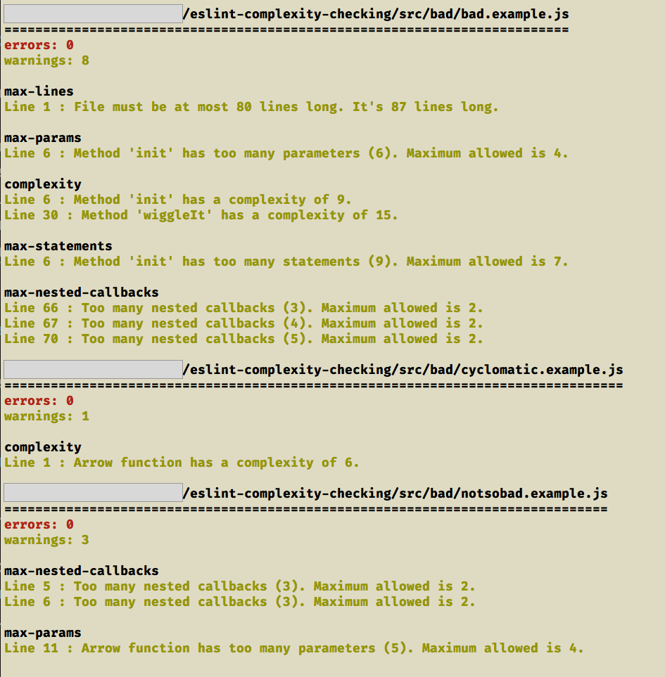

# Find the most complex code using eslint

This repo accompanies a blog post at [www.webpusher.ie/]().

## Intention

The example project highlights eslint config that warns the coder of complexity issues such as:

- cyclomatic complexity
- too many statements per function
- too many statements per line
- excessive params in functions
- number of nested callbacks
- nesting in code blocks
- file length

Code that has any of these issues can be harder to maintain and understand, so it is worthwhile taking a little time to refactor, reduce and remove unwanted complexity. You need to recognise it first!

## Pre-requisites

The project uses node 8.11.2

## Getting started

You should be able to get started simply by running:

```javascript
npm install
npm run lint:sorted
```

This will generate an output as below



## What does it all mean?

The output has sorted the files, placing those that contain the most errors and/or warnings at the top of the list. In addition it has grouped the issues by the eslint rule they break, and also colour-highlighted the output in a familiar scheme - red for errors and yellow for warnings.

## Cyclomatic weighting

The cyclomatic complexity is a measure of the independent paths through a piece of code. The measure is divided by four and added to the error or warning count before being evaluated when sorting the list of problematic files.

This is why, in the example, the file `cyclomatic.example.js` with only a single cyclomatic warning is listed above the file `notsobad.example.js` which has 3 warnings. None of the 3 warnings in `notsobad.example.js` are due to cyclomatic complexity so they are relatively less important when you consider the entire codebase.

For the example above, the file `bad.example.js` has two instances of excessive cyclomatic complexity.

```
complexity
Line 6 : Method 'init' has a complexity of 9.
Line 30 : Method 'wiggleIt' has a complexity of 15.
```

They both will contribute extra weighting to the file - `9 / 4 = 3` and `15 / 4 = 4` for a total of 7 added to the warning count - ensuring it will appear at the top of the list of problem files.

## Why aren't all the files listed

The code in the `good/good.example.js` exhibits no complexity issues and therefore will not appear in the list of problem files.